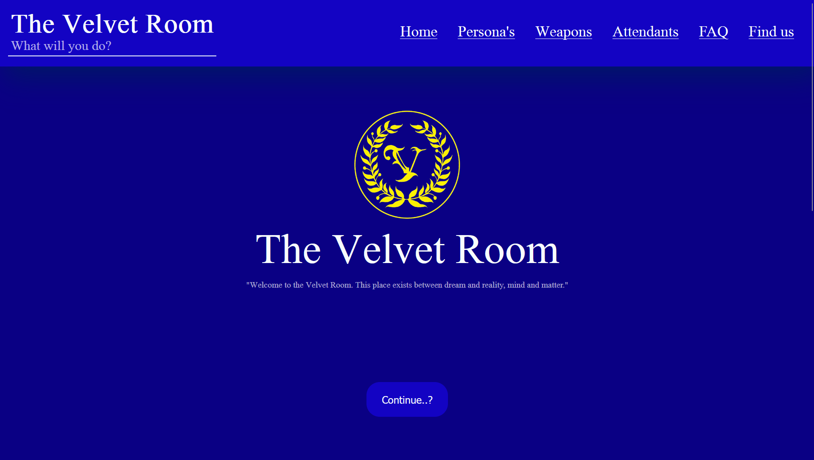
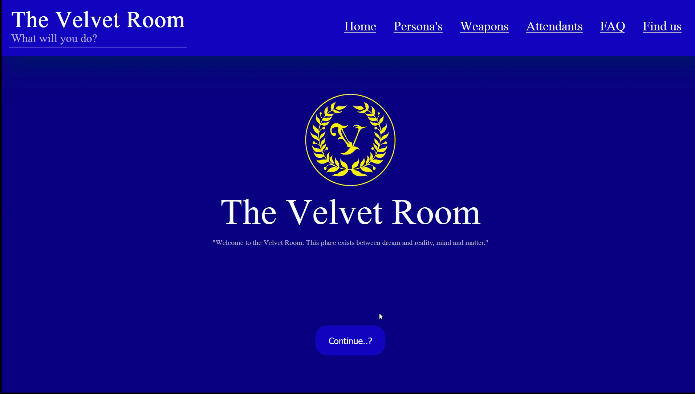
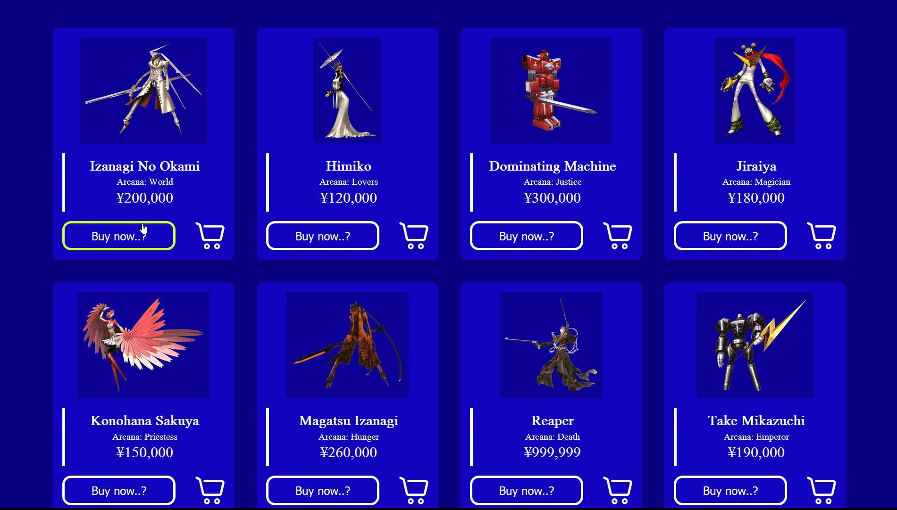
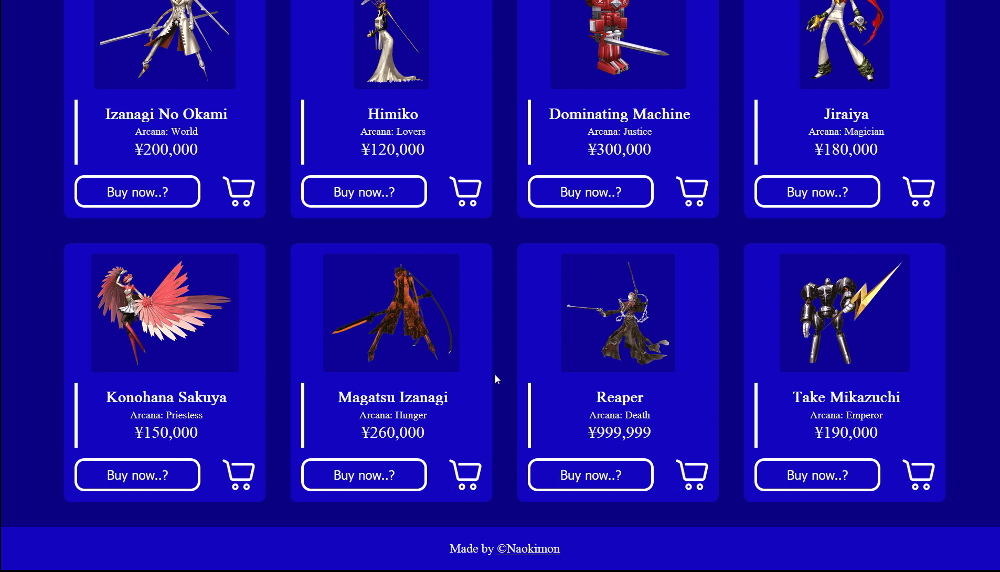

# Webshop: The Velvet Room

This is a webshop made for an assignment for class. It is heavily based on [The Velvet Room](https://megamitensei.fandom.com/wiki/Velvet_Room) from the game franchise [Persona](https://en.wikipedia.org/wiki/Persona_(series)).

## 🖌️ Design

First question I had to ask myself was which group I am targetting. It's a fake webshop so I choose to do it about one of my favorite gaming franchise's [Persona](https://en.wikipedia.org/wiki/Persona_(series)). It targets Persona user's with the wildcard ability which allows them to possess more than one. De vibe can't be established as [The Velvet Room](https://megamitensei.fandom.com/wiki/Velvet_Room) comes from ones heart and changes the interior every single game. The only vibe I went with was classy and blue. A lot of blue.

### 📸 Pictures

I assembled pictures of Persona's from the main cast of [Persona 4](https://en.wikipedia.org/wiki/Persona_4) and the enemies, excluding The Reaper which is from [Persona 3](https://en.wikipedia.org/wiki/Persona_3). I also got the logo of the Velvet Room.

### 🎨 Pallete & Font

The font I used is Mongolian Baiti and the hexidecimal codes for the pallete I used are:

- #0a0084: Background color
- #1303c3: Primary color
- #d3fe28: Secondary color
- #f7fdfd: Border color / Text color

## 💻 Landingpage

Here you will see the first step of my design for the landingspage.

### 🧭 Hero & Navigation

The navigation is inside the header with space between the hero and the navigation options. It changes color when hovering over it and when you press on Persona it scrolls you smoothly to the Persona's.

### 👆 CTA

The call to action isn't much it slides you smoothly to the same Persona part of the website. I might change it at a later date to a seperate page to display Persona's, Weapons and other stuff I might add.

### 🛒 Products

The products are Persona's from the main cast as of the fourth installment mentioned in design. The button's change on hover but aren't interactable yet. Nothing happens when you press on them.

### Footer

The footer is simple, it's my username with a hyperlink attached to it leading to my github profile.

